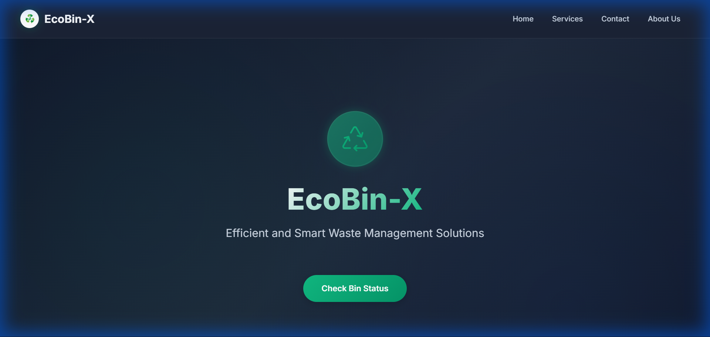
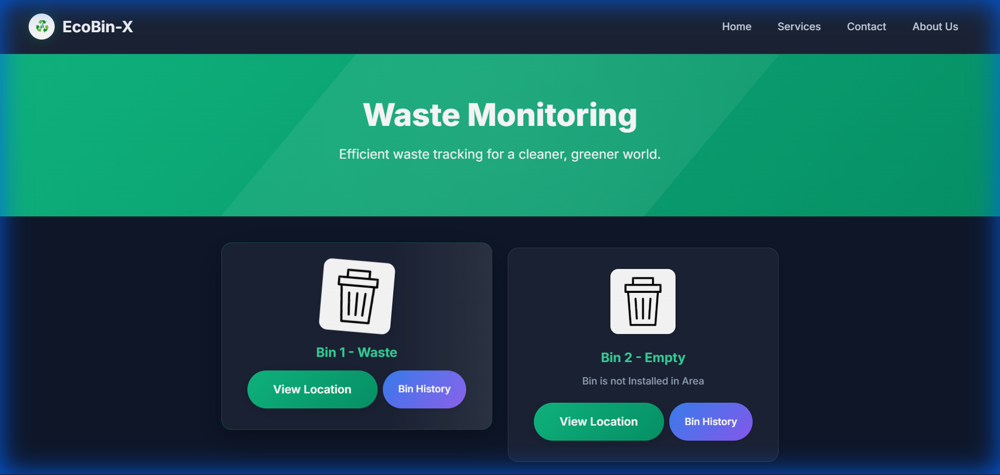
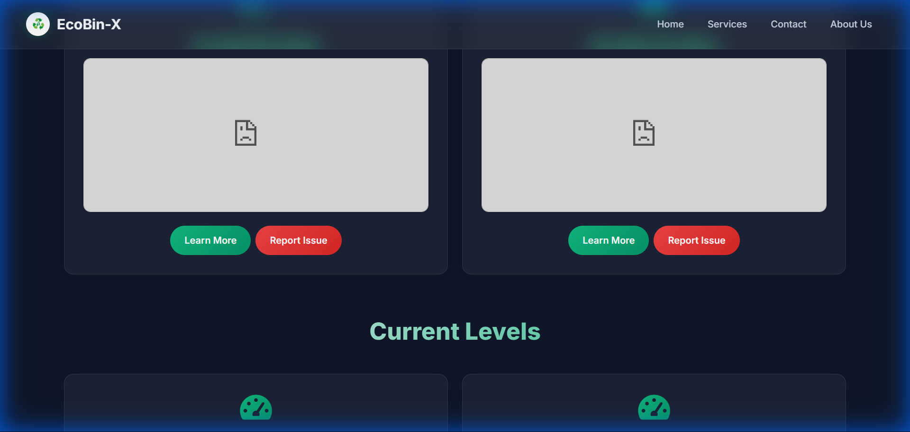
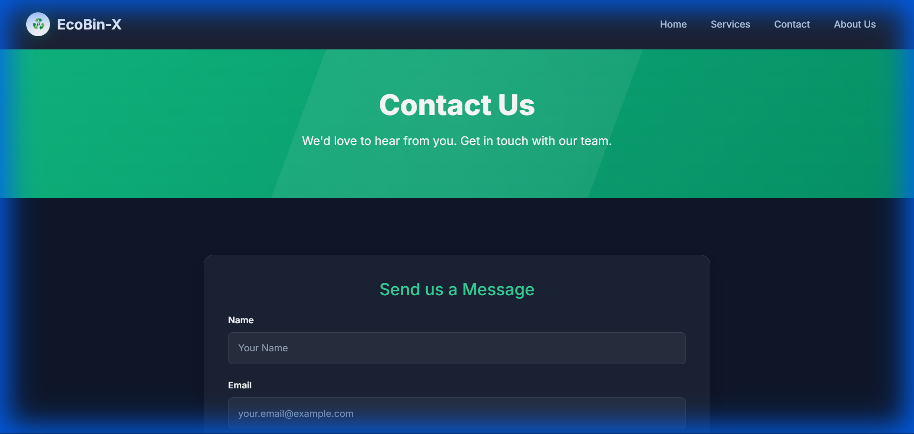
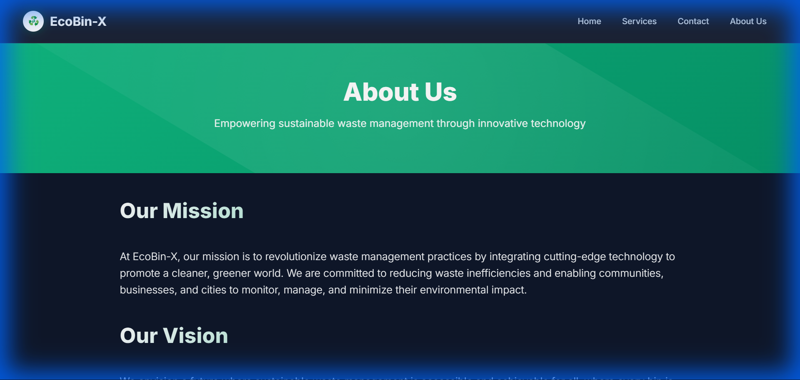
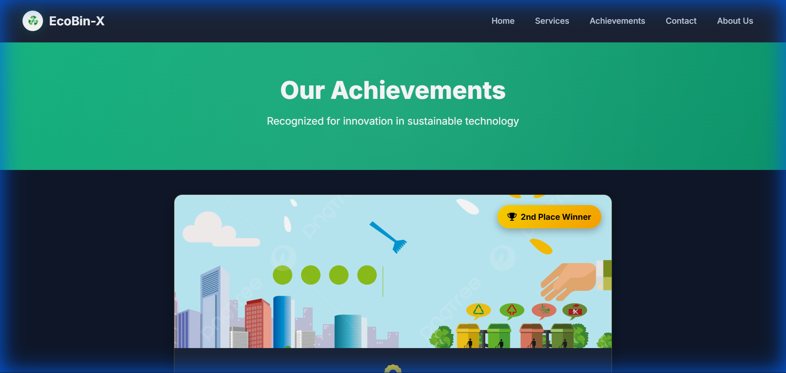
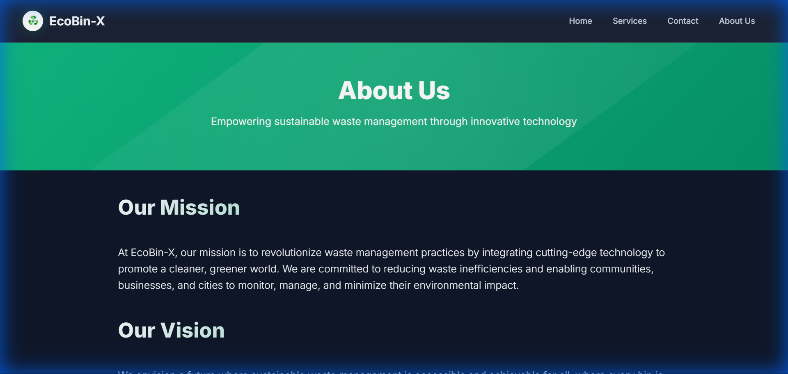

# 🌿 EcoBin-X: Smart Waste Management System

## 📋 Project Overview
**EcoBin-X** is a state-of-the-art smart waste management solution designed to optimize waste collection in urban environments. It combines a premium, modern web dashboard with real-time IoT monitoring and an automated SMS alert system.

The system monitors waste levels in real-time using ThingSpeak API integration and provides actionable insights to waste management teams, ensuring timely collection and reducing overflow risks.

---

## ✨ Key Features

### 1. 🎨 Modern User Interface
- **Glassmorphism Design**: Frosted glass effects on cards and navigation.
- **Premium Aesthetics**: Rich green gradients and dark mode themes.
- **Responsive Layout**: Fully optimized for desktop, tablet, and mobile.
- **Micro-interactions**: Smooth hover effects and animated icons.

### 2. 📊 Real-Time Dashboard
- **Live Data**: Fetches waste levels every 10 seconds from ThingSpeak.
- **Visual Indicators**: Dynamic bin images change based on fill levels.
- **Location Tracking**: Integrated Google Maps links for each bin.
- **History Analytics**: Interactive charts showing fill trends over time.

### 3. 📱 SMS Notification System
- **Automated Alerts**: Sends SMS when bins reach 75% (Warning) or 90% (Critical).
- **Anti-Spam Logic**: Built-in 30-minute cooldown to prevent alert flooding.
- **Multiple Alert Types**:
  - 🚨 **Bin Full**: Single bin warning.
  - 🔴 **Critical**: Both bins overflowing.
  - ⚠️ **Maintenance**: Sensor issues.
  - ✓ **Collection**: Confirmation of emptying.

---

## 📸 Visual Tour

### 🏠 Homepage
The landing page features a clean, modern design with a floating 3D-style icon and glassmorphic navigation.


### 📉 Real-Time Dashboard
Displays live status of Wet and Dry waste bins. The cards feature a frosted glass effect and dynamic status indicators.


### 📊 Historical Analytics
Detailed charts showing waste generation patterns over time, helping in route optimization.


### 🛠️ Services Overview
Showcasing the range of waste management solutions offered.


### ℹ️ About Us
Company mission and vision presented in a clean, readable layout.


### 🏆 Achievements Page
Celebrating the project's success with a dedicated awards page featuring a confetti animation and "2nd Place" badge.


### 📞 Contact Page
Modern contact form with focus animations and clear contact information.


---

## 💻 Technical Architecture

### Tech Stack
- **Frontend**: HTML5, CSS3 (Custom Design System), JavaScript (ES6+), Bootstrap 5
- **Backend / Scripting**: Python 3.x
- **IoT Platform**: ThingSpeak API
- **Notifications**: Twilio SMS API

### File Structure
```
Ecobin-x/
├── index.html          # Landing page
├── welcome.html        # Main dashboard (Real-time data)
├── bin.html           # Analytics & History
├── styles.css         # Modern Design System (Glassmorphism)
├── sms.py            # SMS Module (Twilio integration)
├── monitor.py        # Automated Monitoring Script
└── screenshots/      # Project documentation images
```

---

## 📝 System Logs & Monitoring

The system includes a robust monitoring script (`monitor.py`) that logs real-time status and alerts.

### Sample Monitoring Log
Below is a capture of the system running in production mode:

```log
============================================================
🚀 EcoBin-X Automated Monitoring System Started
============================================================
📡 Monitoring Channel: 2623279
⏱️  Check Interval: 300s (5 minutes)
⚠️  Warning Level: 75%
🔴 Critical Level: 90%
🔕 Alert Cooldown: 1800s (30 minutes)
============================================================

🔍 Checking bins at 2024-12-03 11:15:00...

📊 Bin Status at 2024-12-03T11:15:00Z
   Wet Waste: 85.0%
   Dry Waste: 42.0%

⚠️ WARNING: Wet waste bin at 85.0%
✓ Message sent successfully! SID: SM82934...

⏳ Next check in 300s...
```

### SMS Alert Preview
The system generates professional, easy-to-read SMS alerts:

```text
🚨 EcoBin-X Alert!

Bin #1 - CSE Block Downtown
Waste Type: Wet Waste
Fill Level: 85%
Status: FULL - Collection Required

Location: https://maps.google.com/...

Please proceed for immediate collection.
```

---

## 🚀 Getting Started

### 1. Web Dashboard
Simply open `index.html` in any modern web browser. No installation required for the frontend.

### 2. SMS System Setup
```bash
# Install dependencies
pip install twilio requests

# Configure credentials in sms.py
# Run the monitor
python monitor.py
```

---

**EcoBin-X** represents the future of smart city waste management—combining beautiful design with powerful, automated technology. 🌱
